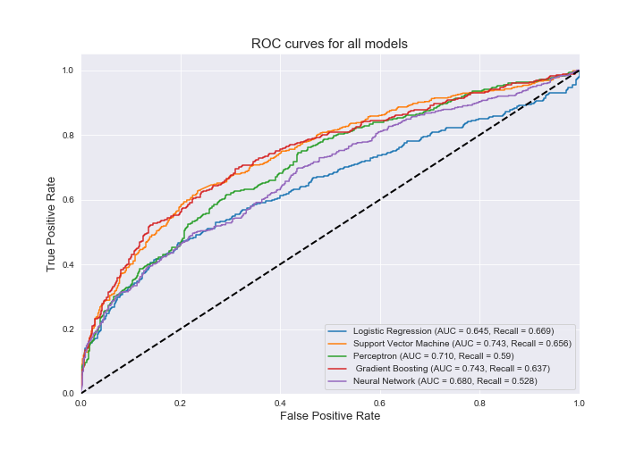

# COVID-19 Infection Rate Prediction (County Level)

**Authors:**  
Wendy Hou (wh916@nyu.edu)
Bichen Kou (bk2374@nyu.edu)
Emmy Phung (mtp363@nyu.edu)
Lily Zhou (yz6121@nyu.edu)

**Abstract**  
When going over Johns Hopkins’ official United States COVID-19 daily data reports, the team noticed that there were a lot of U.S. counties missing from the reports. For example, on 4/12/2020, 529 out of 3147 U.S. counties are missing from Johns Hopkins’ daily COVID-19 report. The goal of this project is to predict the infection rate of these missing counties based on their county feature data, including but not limited to population, education, public and private healthcare information, and popular transportation methods. Furthermore, we analyzed the impacts of these factors on the spread of the pandemic. 

**Data source:**  
1) https://data.census.gov/cedsci/  
2) https://coronavirus.jhu.edu/  

**Models:**
1) **For infection-rate prediction:** Ridge Regression, Lasso Regression, Random Forest, Gradient Boosting, Neural Network  
2) **For risk-level classification:** Logistic Regression, SVM, Perceptron, Gradient Boosting, Neural Network  

